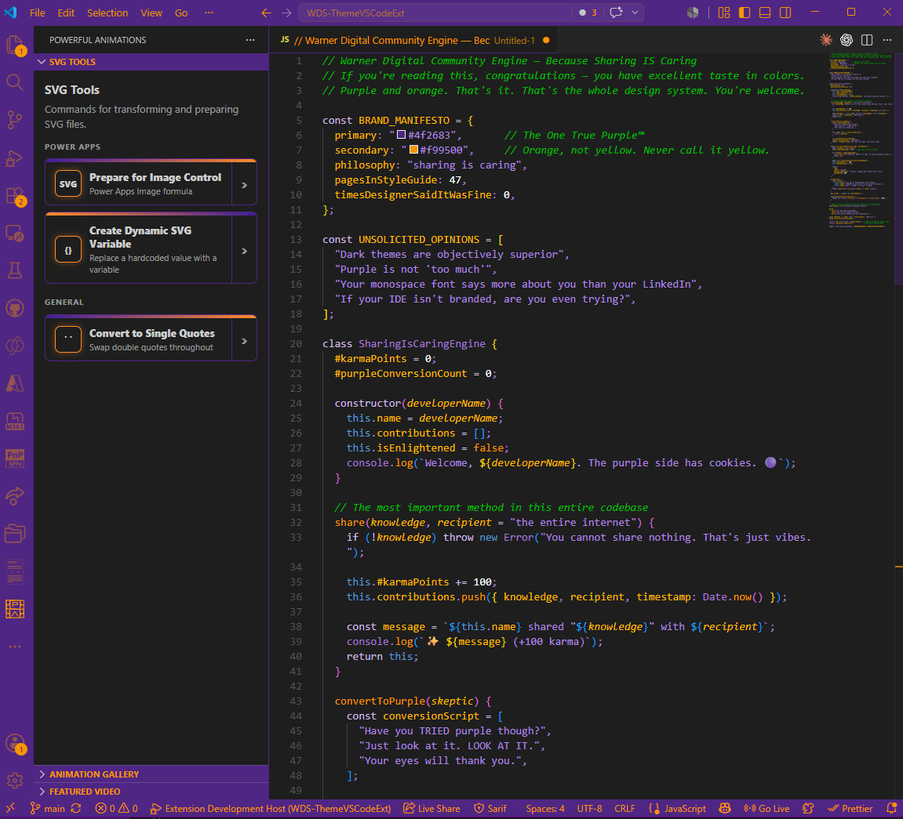
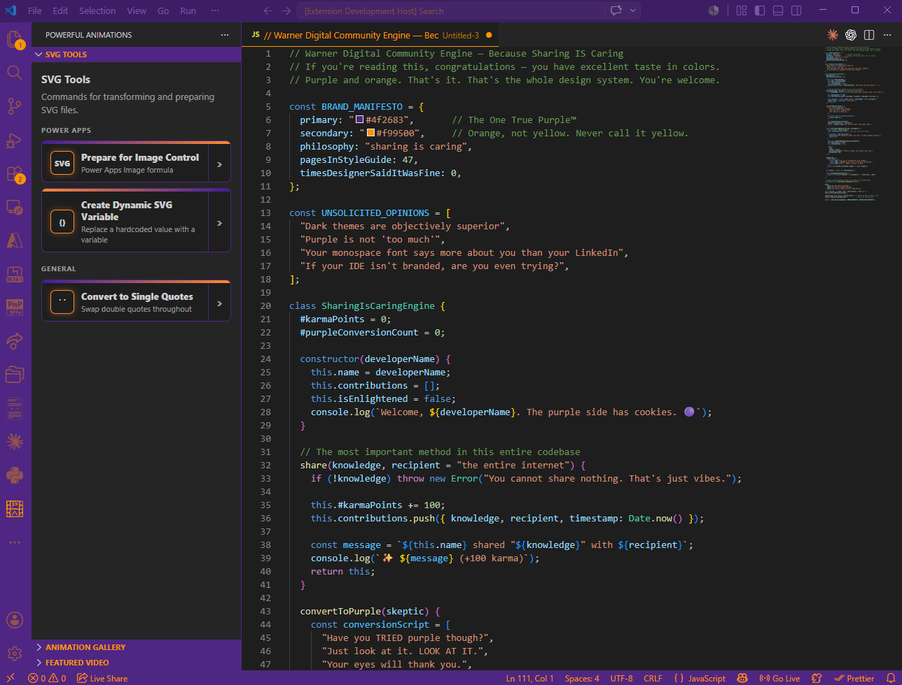
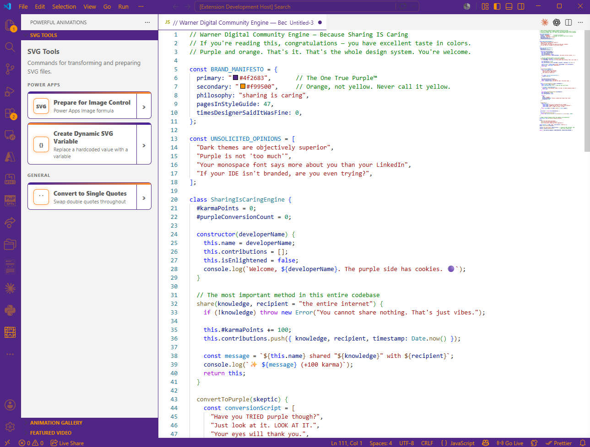

# Warner Digital - VS Code Theme

> *"Purple and orange. That's it. That's the whole design system."*

A dark VS Code theme built around the Warner Digital Studio brand colors: deep purple (`#4f2683`) and orange (`#f99500`). Born from years of `workbench.colorCustomizations` hacks stacked on top of other hacks, this theme finally has its own home - and honestly, it deserves it.

You probably didn't search for this. You stumbled across it. And now you're here, reading a README for a color theme built by one person who really, really likes purple and orange. Welcome. Stay a while.

---

## Why Purple and Orange?

Because it's the Warner Digital brand. But also because:

- **Purple** is regal, creative, and slightly mysterious - like a developer who actually comments their code - SKOL - Go Kings Go
- **Orange** is bold, warm, and impossible to miss - also it looks like fall, and fall is great
- Together they make your IDE look intentional instead of like the default theme you've had since 2017

---

## Screenshots

<!-- SCREENSHOT: Main theme - open screenshot-sample.js in the dev host, switch to Warner Digital -->
**Warner Digital - your daily driver**

<!-- SCREENSHOT: Demo Dark - same file, switch to Warner Digital - Demo Dark -->
**Warner Digital Demo Dark - for presentations in dark rooms using standard syntax highlighting and coloring**

<!-- SCREENSHOT: Demo Light - same file, switch to Warner Digital - Demo Light -->
**Warner Digital Demo Light - for presentations in bright rooms using standard syntax highlighting and coloring**

---

## Themes Included

### Warner Digital *(your daily driver)*

Full purple/orange everything. Activity bar, status bar, title bar, editor highlights, IntelliSense - all of it. For when you want your IDE to have a *personality*.

### Warner Digital - Demo Dark *(for presentations in dark rooms)*

Same branded chrome, VS Code Default Dark+ token colors underneath. Because sometimes you're screensharing and your colleagues need to actually read the code without squinting through a wall of lavender.

### Warner Digital - Demo Light *(for presentations in bright rooms)*

Same branded chrome, VS Code Default Light+ token colors on a white editor. For conference rooms with aggressive overhead lighting and a projector that washes out everything below 80% brightness.

---

## Features

- **Activity bar, status bar, title bar** - full purple/orange branding, top to bottom
- **Editor** - dark `#1e1e1e` background, orange cursor (finally visible), orange selections (also finally visible)
- **Token colors** - green comments, light-purple strings, orange functions, mid-purple types, white numbers
- **IntelliSense popup** - explicitly styled so the autocomplete dropdown doesn't look like an identity crisis
- **Bracket matching** - orange borders, because finding your closing bracket shouldn't require squinting
- **Three theme variants** - because one size fits no one

---

## Installation

Search for **Warner Digital** in the VS Code Extension Marketplace and click **Install**. Then open the Command Palette (`Ctrl+K Ctrl+T`) and select **Warner Digital** (or one of its demo variants). Your eyes will adjust. Embrace the purple and orange 🧡💜😍.

---

## Contributing

Sharing is caring. Genuinely.

If something looks off in a language I haven't tested, open an issue or submit a PR. Token color scopes are a rabbit hole and I haven't gone down all of them. If you find one that makes you say "why is that purple?" - please tell me. I want to know.

- Found a color that's unreadable? File an issue.
- Have a language-specific token scope fix? Submit a PR.
- Just want to say the theme is great? GitHub Stars are free and deeply appreciated.

---

## The Backstory

This theme started as a `workbench.colorCustomizations` block in a `settings.json` file. Then it got bigger. Then it had inline comments. Then it had commented-out experiments. Then it had a comment block that said `"OLD - DO NOT DELETE"` from 2019.

Now it's a real extension. A proper, packaged, publishable extension. I've come a long way.

---

*Built with purple, orange, and an unhealthy attachment to a specific hex code.*
*Warner Digital Studio - [warner.digital](https://warner.digital)*
